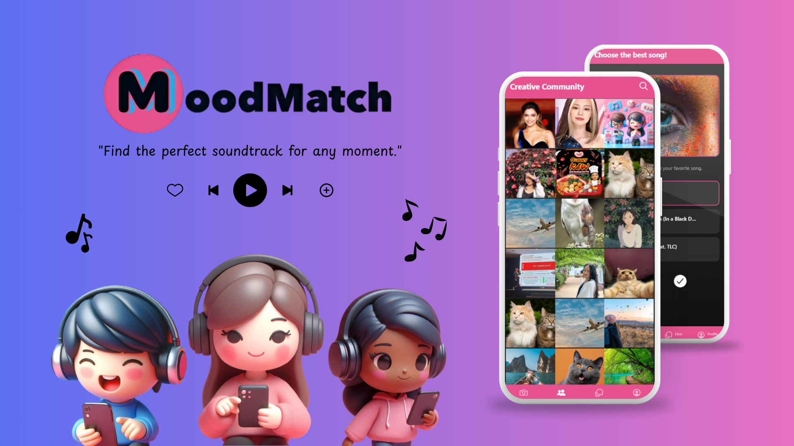
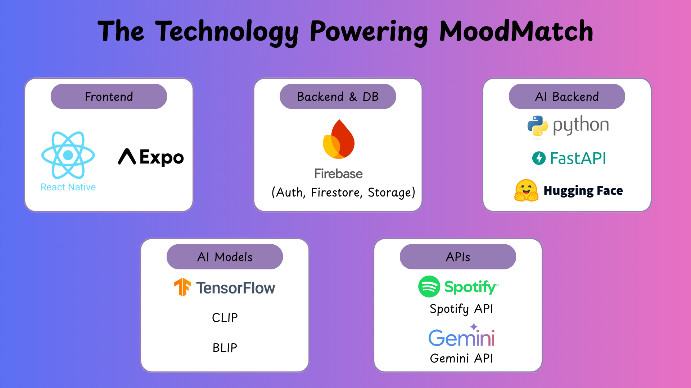

# MoodMatch 🎶📸

MoodMatch is an AI-powered mobile application that recommends songs and captions based on images uploaded by users. It enhances creativity by combining image analysis with music and text generation, while also providing a community space for users to share, comment, and interact.

  

---

## Features

- **Image Analysis**: Upload or capture an image to analyze its content and mood.
- **Song Recommendation**: Get relevant song suggestions via the Spotify Web API.
- **Caption Recommendation**: Generate creative captions based on the uploaded image.
- **User Feedback**: Like or dislike songs/captions to improve personalized recommendations.
- **Community Interaction**: Post images, share ideas, comment, and chat with other users.
- **Secure Authentication**: Firebase-based user registration, login, and profile management.

---

## Architecture & Tech Stack

**Architecture Overview**
1. **Frontend (Mobile App)**: User interface for uploading images, viewing recommendations, and interacting with the community.
2. **Backend (AI & API)**: Image analysis using CLIP/BLIP models, connected to Spotify Web API for music recommendations.
3. **Database & Authentication**: Firebase manages user accounts, data storage, and community interactions.

**Tech Stack**
- **Frontend**: React Native (Expo)
- **Backend**: FastAPI (deployed on Hugging Face Spaces)
- **AI Models**: CLIP (genre prediction), BLIP (image captioning)
- **Music API**: Spotify Web API
- **Database & Auth**: Firebase (Firestore, Authentication, Storage)

  

---
